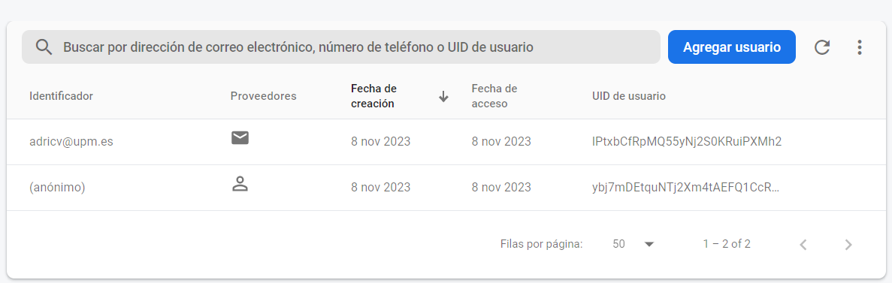
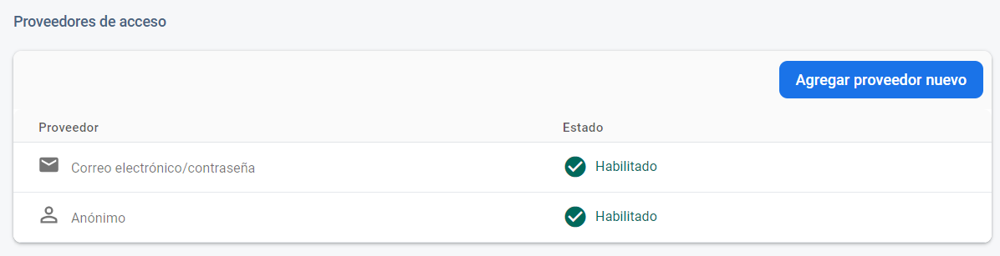
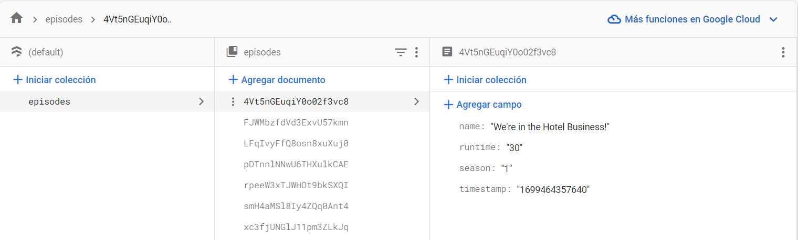

# API empleada: TvMaze [!https://www.tvmaze.com/api]

Se ha empleado una API que obtiene un listado de episodios que van a ser o han sido
retransmitidos en el país indicado (el mismo día en que se realiza la petición).
Una vez se realiza la petición, se persistirán sólo aquellos episodios cuyos atributos
imprescindibles
(nombre, duración y temporada) tengan un valor definido con el fin de mostrar información de
interés.

# Imágenes Firebase

- Lista usuarios - Authentication
  
- Proveedores - Authentication
  
- Firestore database
  

Autor -> Adrián Castro Vilar

Práctica de FEM - MiW UPM
